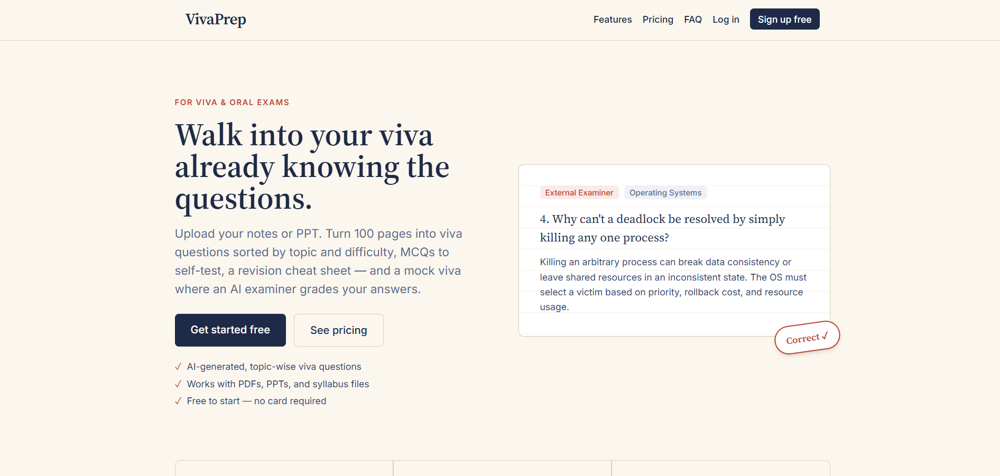
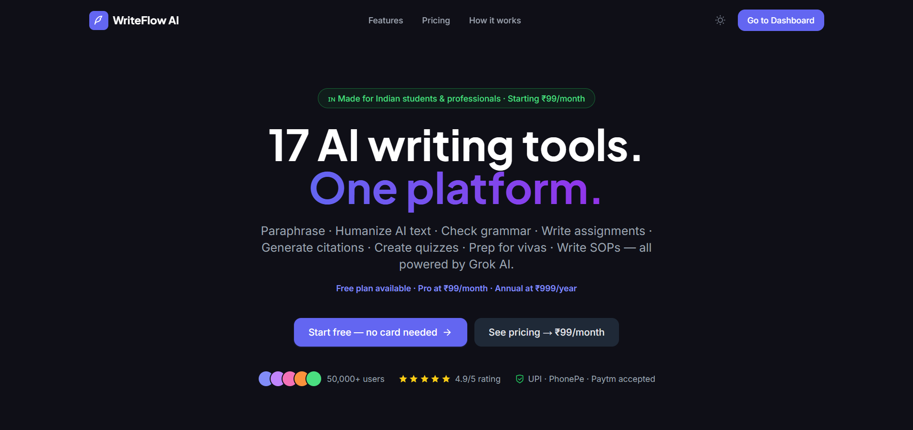
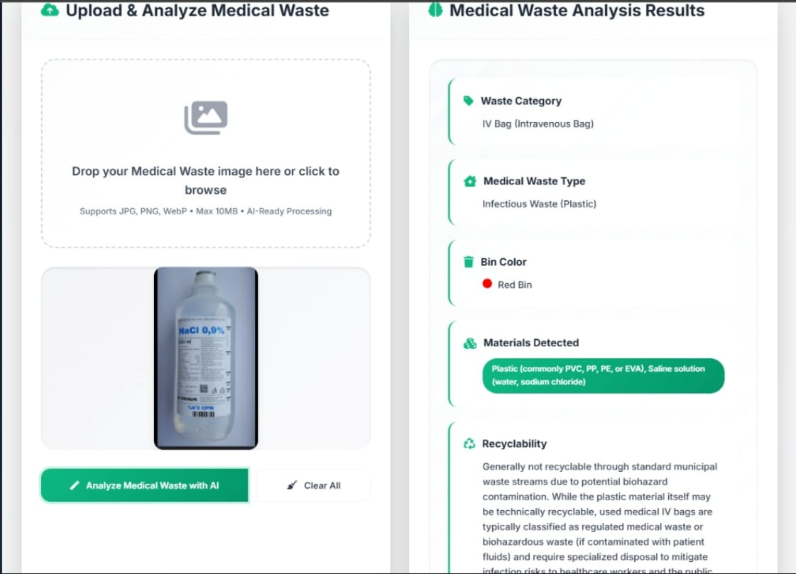

# Mustansir Dabhiya

AI & Data Science Student · Full Stack Developer

 

 

## 🧑‍💻 About Me

I'm an **AI & Data Science Engineering student** who builds full stack web applications with AI woven in where it genuinely adds value — not just for the sake of it. I like owning a project end to end: shaping the idea, designing the interface, building the backend, and getting AI features to actually work reliably.

- 🔭 Currently building **AI-powered web applications**
- 🧠 Deepening my understanding of **NLP** and **Deep Learning**
- 🌐 Solid foundation across the **MERN stack**
- 📈 Learn-by-building — most of what I know came from shipping real projects

 

## 🛠️ Tech Stack

<table width="100%">
<tr>
<td align="center" width="20%"><b>Frontend</b>  </td>
<td align="center" width="20%"><b>Backend</b>  </td>
<td align="center" width="20%"><b>Database</b>  </td>
<td align="center" width="20%"><b>Languages</b>  </td>
<td align="center" width="20%"><b>Tools</b>  </td>
</tr>
</table>

**AI / Data Science**

-1a1b27?style=for-the-badge&logo=OpenAI&logoColor=7aa2f7)
-1a1b27?style=for-the-badge&logo=TensorFlow&logoColor=7aa2f7)

 

## 🚀 Featured Projects

<table>
<tr>
<td width="50%">

**VivaPrep**
AI-powered Viva Preparation Platform that converts PDFs into viva questions, MCQs, and summaries.

</td>
<td width="50%">

**WriteFlow AI**
AI writing assistant suite offering multiple AI-powered tools for different writing needs.

</td>
</tr>
<tr>
<td colspan="2">

**EcoSort**
AI-powered waste classification platform, backed by a published research paper and a registered software copyright.

</td>
</tr>
</table>

 

## 🏆 Publications & Achievements

 

## 🚧 Currently Building

 

## 🌱 Currently Learning

 

---

 

### 📊 GitHub Statistics

  

  

 

### 💬 Random Dev Quote

 

## 📬 Connect With Me

 

---

 

### 🐍 Contribution Snake

*(Activates automatically once the GitHub Action is set up.)*

 

**"Code is like humor. When you have to explain it, it's bad." — Cory House**

